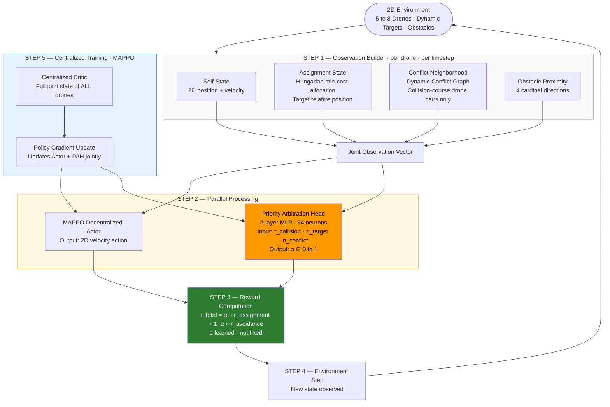

# Framework Pipeline Diagram — 2D Version

Paste the code below into **mermaid.live** → diagram tayyar.

---



---

## Reading the Diagram

| Box | Kya hai |
|---|---|
| **2D Environment** | Simulation — 5 to 8 drones, dynamic targets, obstacles |
| **Observation Builder** | Har drone 4 cheezein observe karta hai (self, target, neighbors, obstacles) |
| **MAPPO Actor** | Action decide karta hai — 2D velocity |
| **Priority Arbitration Head (orange)** | α decide karta hai — assignment kitna, avoidance kitna |
| **Reward Computation (green)** | r = α × r_assign + (1−α) × r_avoid — α fixed nahi, learned hai |
| **Centralized Critic (blue)** | Training mein sab drones ka poora state dekhta hai |
| **Policy Gradient Update** | MAPPO Actor aur PAH dono ko SAATH update karta hai |

---

## PAH — Priority Arbitration Head (Main Contribution)

```
Inputs (3 numbers, per timestep):
  τ_collision  →  kitne seconds mein collision hoga
  d_target     →  assigned target kitna door hai
  n_conflict   →  conflict neighborhood mein kitne drones hain

Output (1 number):
  α ∈ [0, 1]
    α → 1  :  assignment dominant  (target ki taraf jao)
    α → 0  :  avoidance dominant   (collision se bacho)

Formula:
  r_total = α × r_assignment + (1−α) × r_avoidance

Training:
  MAPPO actor ke saath jointly — koi alag training loop nahi
  Centralized critic mein koi change nahi
```

**Yeh kyun novel hai:**
DA-MAPPO aur IGAT-MARL dono mein α fixed constant hai — training se pehle manually set hota hai, kabhi nahi badlta.
PAH mein α **seekhta hai** — har timestep pe situation dekh ke decide karta hai. Kisi bhi existing framework mein yeh nahi hai.
