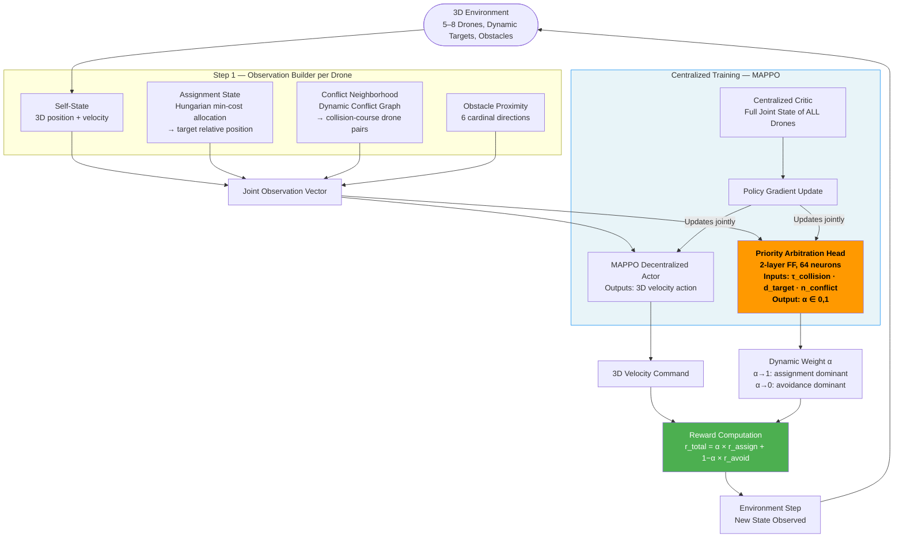

# Framework Pipeline — Mermaid Diagram Code

Copy-paste this into any Mermaid renderer (e.g., mermaid.live) to get the visual diagram.

---

---

## What Makes This Novel

| Component | Existing Frameworks | This Framework |
|---|---|---|
| Reward weighting | Fixed constants (DA-MAPPO: fixed C_collision; IGAT-MARL: fixed P1, P2) | **Learned α — changes every timestep** |
| Assignment + avoidance | Handled by separate frameworks | **Joint observation, single policy** |
| 3D environment | DA-MAPPO: 2D; IGAT-MARL: 2D | **3D — altitude adds vertical collision courses** |
| Priority Arbitration Head | Does not exist | **First learned arbitration mechanism in multi-UAV coordination** |

---

## PAH Technical Spec (for Methodology section)

- **Architecture:** 2-layer feedforward MLP, 64 hidden neurons, ReLU activation, sigmoid output
- **Inputs (3 scalars):**
  - τ_collision — time-to-collision with nearest conflict neighbor (seconds)
  - d_target — Euclidean distance to assigned target (meters)
  - n_conflict — count of drones currently in conflict neighborhood
- **Output:** α ∈ [0,1] (single scalar per drone per timestep)
- **Training:** Jointly with MAPPO actor via same policy gradient update; no separate training loop
- **Critic:** No change to centralized critic — PAH adds zero parameters to the critic
- **At deployment:** Runs decentralized on each drone using only local observation
- **Reward formula:** r_total = α × r_assignment + (1−α) × r_avoidance
