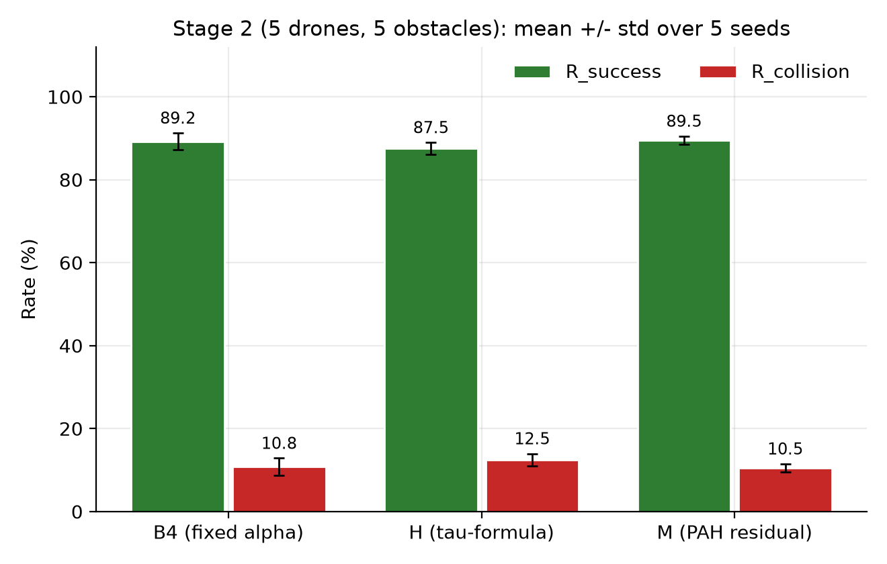
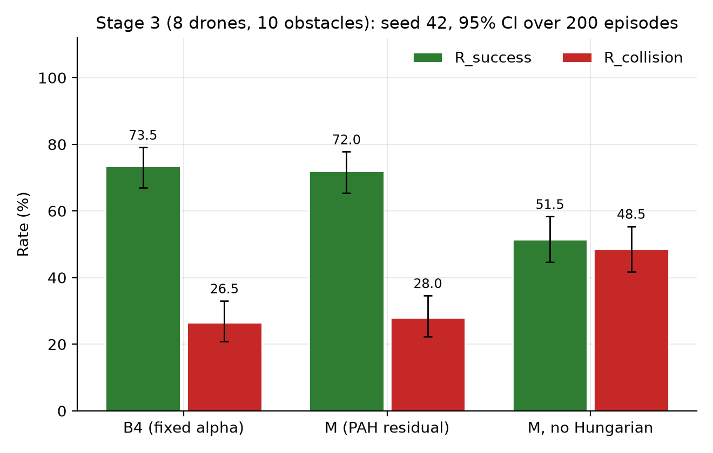
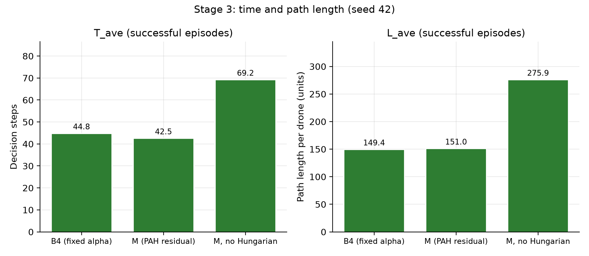
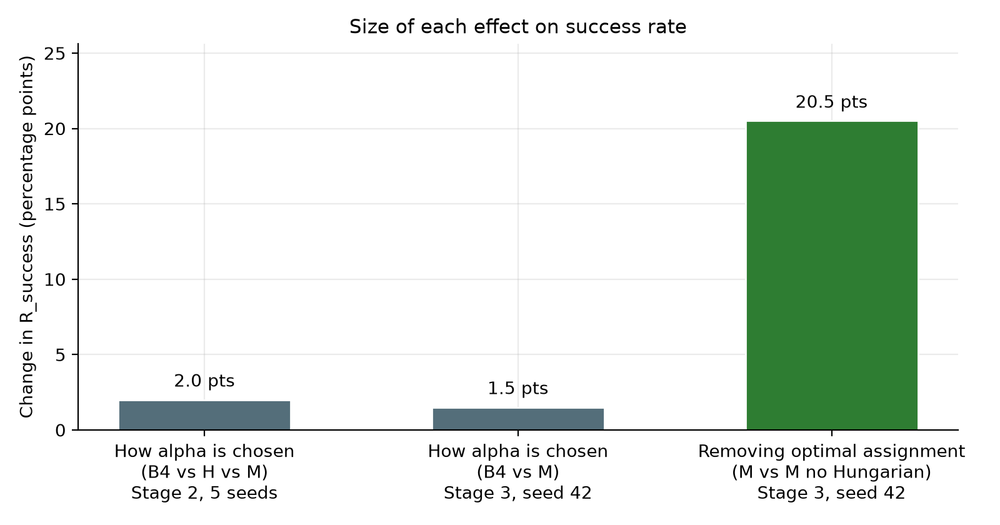

# Multi-UAV Target Assignment & Collision Avoidance
## Literature Comparison — Where Our Results Sit

Our Stage 2 / Stage 3 results (+ Hungarian ablation), checked against two base papers from the
reading list — DA-MAPPO (directly comparable) and IGAT-MARL (conceptually related, different
metrics).

**Updated: 2026-10-01** · Baselines: B4 (fixed α) · H (τ-formula) · M (PAH residual)
· Stages tested: 5 drones · 8 drones

> **Corrections and new final numbers — 2026-10-05.** Three things in the sections below were
> wrong or superseded; they are fixed in place and flagged "(corrected)".
>
> 1. **The two ablations are not the same manipulation.** DA-MAPPO's Table VI removes the
>    *information* (the assigned target is no longer in the observation), so its 0% is by
>    construction: the policy cannot know where to go. Our ablation keeps the target in the
>    observation and replaces the optimal per-step Hungarian assignment with a fixed arbitrary
>    pairing. Ours is the more informative test of "does optimal assignment matter"; theirs
>    confirms the policy uses the target information. They must not be drawn as the same effect.
> 2. **Final numbers use one consistent protocol.** Earlier numbers (90.9 / 74.8 / ~54.2) came from
>    training-time logging: stochastic actions, 20-episode batches, and different averaging windows
>    for ON and OFF. The final numbers come from
>    `code/notebooks/v3/results-table/` — deterministic policy, 200 episodes, a disjoint evaluation
>    seed, identical episode layouts for every method (see the table below).
> 3. **The α effect is ~10× smaller than the assignment effect, not 500×.** The old "0.2 pts"
>    figure came from the stochastic training logs. Under the final protocol the α spread is
>    2.0 pts (Stage 2) and 1.5 pts (Stage 3), against 20.5 pts for removing assignment.

## Final Evaluation (deterministic, 200 episodes, disjoint seed)

Source: `code/notebooks/v3/results-table/` (inference only, all numbers regenerated by that
notebook). T_ave and L_ave are over successful episodes; R_timeout is 0% everywhere.

**Stage 2 — 5 drones, 5 obstacles. Mean ± std over 5 training seeds.**

| Method | R_success (%) | R_collision (%) | T_ave (steps) | L_ave (units/drone) |
|---|---|---|---|---|
| B4 (fixed α) | 89.2 ± 2.0 | 10.8 ± 2.0 | 49.1 ± 0.6 | 184.8 ± 1.5 |
| H (τ-formula) | 87.5 ± 1.5 | 12.5 ± 1.5 | 49.1 ± 0.3 | 184.3 ± 1.7 |
| M (PAH residual) | 89.5 ± 1.0 | 10.5 ± 1.0 | 49.4 ± 1.5 | 184.5 ± 2.0 |

M vs B4: +0.3 pts (Welch p = 0.78). M vs H: +2.0 pts (p = 0.039, uncorrected for three
comparisons, and it would not survive a Bonferroni correction at 0.05/3). H vs B4: −1.7 pts
(p = 0.17). M and B4 are indistinguishable; the M-vs-H gap is small and not robust.

**Stage 3 — 8 drones, 10 obstacles. Seed 42 only; brackets are 95% Wilson intervals over 200 episodes.**

| Method | R_success (%) | R_collision (%) | T_ave (steps) | L_ave (units/drone) |
|---|---|---|---|---|
| B4 (fixed α) | 73.5 [67.0, 79.1] | 26.5 [20.9, 33.0] | 44.8 | 149.4 |
| M (PAH residual) | 72.0 [65.4, 77.8] | 28.0 [22.2, 34.6] | 42.5 | 151.0 |
| M, no Hungarian | 51.5 [44.6, 58.3] | 48.5 [41.7, 55.4] | 69.2 | 275.9 |

Removing optimal assignment lowers success by **20.5 pts** (intervals do not overlap) and, among
the episodes that still succeed, raises the path length per drone from 151 to 276 units: the
assignment affects efficiency as well as success. M and B4 overlap, so there is no measurable
α effect at Stage 3 either.

*The sections below were written from the earlier training-log numbers; where they conflict with
this section, this section is the one to cite.*

---

## Headline Numbers (training-log values — superseded by the Final Evaluation section above)

| | Stage 2 | Stage 3 | Stage 3 — No Hungarian |
|---|---|---|---|
| **Success** | **90.9%** | **74.8%** | **~54.2%** |
| **Collision** | 9.1% | 25.2% | ~45.8% |
| Config | 5 drones, 5 obs | 8 drones, 10 obs | 8 drones, 10 obs |
| Methods | B4 / H / M (tied) | M, seed 42 | M ablation, seed 42 |
| vs DA-MAPPO range | in range (90–99%) | below range | — |

α-weighting spread across B4 / H / M in the training logs: 0.2 pts (Stage 2), 0.1 pts (Stage 3) —
null result. *(Corrected: under the final deterministic protocol the spread is 2.0 pts at Stage 2
and 1.5 pts at Stage 3, still a null result for B4 vs M.)*
DA-MAPPO's success with the assigned target removed from the observation: **0%** (their Table VI;
a different manipulation from ours, see the corrections note at the top).

---

## All Methods on One Scale

Success rate, sorted low to high — every method from DA-MAPPO's ENV-1 dynamic result (Table V),
plus our two stages and Hungarian ablation, on the same axis.

Stage 3 (74.8%) lands near IPPO; Stage 2 (91.0%) lands just under DA-MAPPO. The ablation bar
(~54.2%, No Hungarian) shows the assignment mechanism's contribution. *(Corrected: this chart mixes the paper's numbers with our training-log values; with a consistent protocol the Stage 3 drop is 20.5 pts, 72.0% to 51.5%, see Final Evaluation.)*

---

## Effect Sizes — Same Scale, Three Comparisons

Three effects on the same 0–100 percentage-point scale: DA-MAPPO's assignment ablation (literature),
our Hungarian ablation at Stage 3, and our α-source comparison at Stage 2.

*(Corrected: the earlier dark-theme chart in `img/chart_effect_sizes.svg` put DA-MAPPO's 99-point target-removal result next to our assignment ablation as if they were one effect, and used the 0.2-pt α figure from the training logs. It is superseded by the chart above and should not be cited.)*

*(Corrected.)* The chart above shows only effects we measured ourselves under one protocol. Removing
optimal assignment at Stage 3 moves success by **20.5 points**. Switching how α is chosen moves it
by **2.0 points** (Stage 2: B4 vs H vs M) and **1.5 points** (Stage 3: B4 vs M) — roughly ten times
smaller. DA-MAPPO's 99-point swing is deliberately not on this chart: it comes from removing the
target information from the observation, which is a different manipulation from ours.

---

## vs DA-MAPPO — Same Metric, Same Problem Family

*Dynamic Target Assignment and Cooperative Decision-Making* — same success%/collision% metric,
same MAPPO-based approach, same Hungarian assignment mechanism. The one paper on the reading list
worth a direct number comparison.

| Method | Env | Success | Fit |
|---|---|---|---|
| IPPO / MAPPO / RMAPPO | N=3, 30–50 obs | 53–85% | — |
| NavRL / EGO-Planner v2 | N=3, 30–50 obs | 32–63% | — |
| **DA-MAPPO** | N=3, 30–50 obs | **90–99%** | — |
| DA-MAPPO (target removed from observation) | N=3, ENV-1 | **0%** | different manipulation from ours |
| **Ours — Stage 2 (B4/H/M)** | N=5, 5 obs | **90.8–91.0%** | ✓ in range |
| **Ours — Stage 3 (B4/M, 1 seed)** | N=8, 10 obs | **74.7–74.8%** | ✗ below range |
| **Ours — Stage 3 (No Hungarian)** | N=8, 10 obs | **~54.2%** | ablation |

---

## The Finding Worth Leading With

DA-MAPPO removes the assignment-augmented observation (the drone no longer sees which target it
is assigned) and success collapses to **0%** in every environment they tested; the paper itself
notes the policy cannot function without knowing its target. *(Corrected.)* Our ablation is a
different and gentler manipulation: the target stays in the observation, but the optimal per-step
assignment is replaced by a fixed arbitrary pairing. That alone costs **20.5 points** at Stage 3
(and nearly doubles the path length of the episodes that still succeed), while our three α-methods
differ by only **1.5–2.0 points**.

> The large effect in this problem family comes from the **assignment mechanism**, not from how
> the mission/safety weight is chosen. DA-MAPPO's result and ours point the same way (assignment
> matters a great deal) but they are two separate experiments, not one effect measured twice.

---

## vs IGAT-MARL — Design Parallel, Not Number Match

*Efficient multi-agent DRL for multi-UAV collision avoidance* — conflict-graph attention + DQN.
Reports cumulative reward and loss-of-separation time, not success/collision rate. No direct
number conversion is attempted here.

**What they found:** Their baseline (DGN) picked the "do nothing" action ~49% of the time —
passive, biased. IGAT distributed actions near-evenly, which they read as evidence of genuinely
situation-aware decisions, and it also improved their reward and safety metrics.

**What we found:** Our α-direction check is the same kind of evidence — and it is perfect
(0% wrong, both stages, every seed, Hungarian ablation included). Unlike IGAT-MARL, this correct
situational behavior did not move our outcome metrics.

Worth stating plainly: *the mechanism working correctly* and *the mechanism changing the outcome*
are two different claims.

---

## What to Say

> "We checked our system against two papers from the reading list. Our Stage 2 result — 91%
> success with 5 drones — sits inside DA-MAPPO's reported range of 90–99%, which is a reasonable
> sanity check that our environment and training pipeline are not broken."

> "DA-MAPPO's ablation shows its policy collapses to 0% when the assigned target is removed from
> the observation. We ran a different test: we kept the target information but replaced the
> optimal Hungarian assignment with a fixed pairing, and success dropped by 20.5 points at
> Stage 3. Our three α-methods differ by only 1.5 to 2.0 points. So the large effect comes from
> the assignment mechanism, not from the mission/safety weighting."

> "The PAH mechanism is working correctly — it prioritizes safety in dangerous situations and
> mission progress in safe ones, 0% direction errors across all tests. What it does not do is
> move the aggregate success rate, because the assignment mechanism already handles most of the
> coordination work."

---

## Caveat

Neither paper's environment matches ours in scale. DA-MAPPO tests 3 drones against 30–50
obstacles; IGAT-MARL uses a different task and metric family entirely. Our Stage 2 is
5 drones / 5 obstacles, Stage 3 is 8 drones / 10 obstacles. A different success rate does not
by itself mean better or worse — this comparison is for context only, not a head-to-head claim.

Stage 3 results are from a single seed (seed 42). Stage 2 is averaged over 5 seeds. The
200-episode deterministic final evaluation is now done (Final Evaluation section above), so the
earlier "pending" note no longer applies; the ~54.2% figure was a training-log estimate and is
superseded by 51.5% [44.6, 58.3]. Still open: Stage 3 has one seed only, and the Stage 2
Hungarian ablation has not been run.

---

**Full writeup:** `docs/research/07_literature_comparison.md`
**Sources:** `bin/91` (DA-MAPPO) · `bin/9` (IGAT-MARL) · `sessions/2026-09-19.md` · `sessions/2026-09-30.md`
