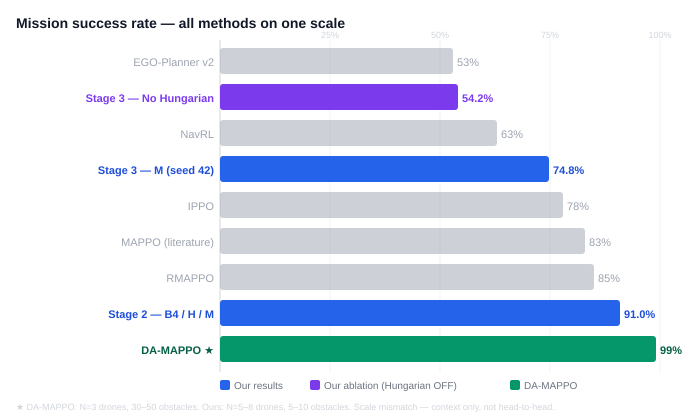
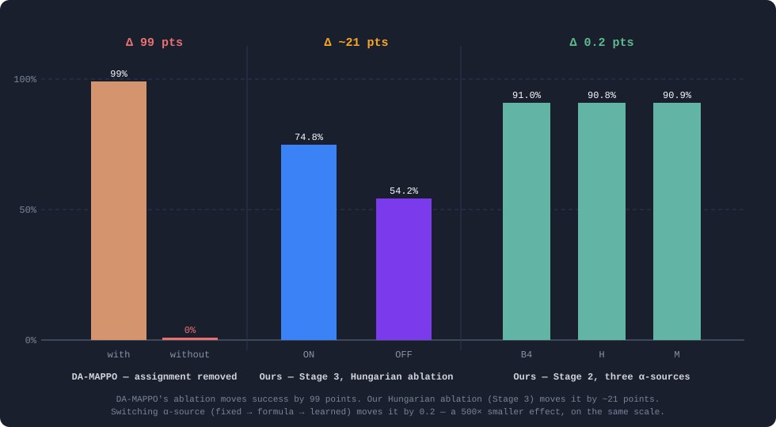

# Multi-UAV Target Assignment & Collision Avoidance
## Literature Comparison — Where Our Results Sit

Our Stage 2 / Stage 3 results (+ Hungarian ablation), checked against two base papers from the
reading list — DA-MAPPO (directly comparable) and IGAT-MARL (conceptually related, different
metrics).

**Updated: 2026-10-01** · Baselines: B4 (fixed α) · H (τ-formula) · M (PAH residual)
· Stages tested: 5 drones · 8 drones

---

## Headline Numbers

| | Stage 2 | Stage 3 | Stage 3 — No Hungarian |
|---|---|---|---|
| **Success** | **90.9%** | **74.8%** | **~54.2%** |
| **Collision** | 9.1% | 25.2% | ~45.8% |
| Config | 5 drones, 5 obs | 8 drones, 10 obs | 8 drones, 10 obs |
| Methods | B4 / H / M (tied) | M, seed 42 | M ablation, seed 42 |
| vs DA-MAPPO range | in range (90–99%) | below range | — |

α-weighting spread across B4 / H / M: **0.2 pts** (Stage 2), **0.1 pts** (Stage 3) — null result.
DA-MAPPO's own success with assignment removed: **0%** (their Table VI ablation).

---

## All Methods on One Scale

Success rate, sorted low to high — every method from DA-MAPPO's ENV-1 dynamic result (Table V),
plus our two stages and Hungarian ablation, on the same axis.

Stage 3 (74.8%) lands near IPPO; Stage 2 (91.0%) lands just under DA-MAPPO. The ablation bar
(~54.2%, No Hungarian) shows the assignment mechanism's contribution — a ~21 pt drop.

---

## Effect Sizes — Same Scale, Three Comparisons

Three effects on the same 0–100 percentage-point scale: DA-MAPPO's assignment ablation (literature),
our Hungarian ablation at Stage 3, and our α-source comparison at Stage 2.

DA-MAPPO's ablation moves success by **99 points**. Our Hungarian ablation moves it by **~21 points**.
Switching how α is chosen (fixed → formula → learned) moves it by **0.2 points** — a 500×
smaller effect, on the same scale.

---

## vs DA-MAPPO — Same Metric, Same Problem Family

*Dynamic Target Assignment and Cooperative Decision-Making* — same success%/collision% metric,
same MAPPO-based approach, same Hungarian assignment mechanism. The one paper on the reading list
worth a direct number comparison.

| Method | Env | Success | Fit |
|---|---|---|---|
| IPPO / MAPPO / RMAPPO | N=3, 30–50 obs | 53–85% | — |
| NavRL / EGO-Planner v2 | N=3, 30–50 obs | 32–63% | — |
| **DA-MAPPO** | N=3, 30–50 obs | **90–99%** | — |
| DA-MAPPO (no assignment) | N=3, ENV-1 | **0%** | ablation |
| **Ours — Stage 2 (B4/H/M)** | N=5, 5 obs | **90.8–91.0%** | ✓ in range |
| **Ours — Stage 3 (B4/M, 1 seed)** | N=8, 10 obs | **74.7–74.8%** | ✗ below range |
| **Ours — Stage 3 (No Hungarian)** | N=8, 10 obs | **~54.2%** | ablation |

---

## The Finding Worth Leading With

DA-MAPPO's own ablation removes the assignment-augmented observation and success collapses to
**0%** — across every environment they tested. Our three α-methods (fixed, formula, learned)
differ from each other by only **~0.2 percentage points**. Our Hungarian ablation shows a
**~21 point** drop for the same kind of removal at Stage 3.

> The comparably large effect in this problem family comes from the **assignment mechanism**, not
> from how the mission/safety weight is chosen. That is independent, external support for what our
> own Stage 2/3 comparison already showed — and our ablation now provides the same kind of direct
> evidence DA-MAPPO reported.

---

## vs IGAT-MARL — Design Parallel, Not Number Match

*Efficient multi-agent DRL for multi-UAV collision avoidance* — conflict-graph attention + DQN.
Reports cumulative reward and loss-of-separation time, not success/collision rate. No direct
number conversion is attempted here.

**What they found:** Their baseline (DGN) picked the "do nothing" action ~49% of the time —
passive, biased. IGAT distributed actions near-evenly, which they read as evidence of genuinely
situation-aware decisions, and it also improved their reward and safety metrics.

**What we found:** Our α-direction check is the same kind of evidence — and it is perfect
(0% wrong, both stages, every seed, Hungarian ablation included). Unlike IGAT-MARL, this correct
situational behavior did not move our outcome metrics.

Worth stating plainly: *the mechanism working correctly* and *the mechanism changing the outcome*
are two different claims.

---

## What to Say

> "We checked our system against two papers from the reading list. Our Stage 2 result — 91%
> success with 5 drones — sits inside DA-MAPPO's reported range of 90–99%, which is a reasonable
> sanity check that our environment and training pipeline are not broken."

> "DA-MAPPO's own ablation study is the most useful thing we found: when they remove their
> assignment mechanism, success drops to 0%. Our three α-methods only differ by 0.2 percentage
> points from each other. Our own Hungarian ablation produced a ~21 point drop at Stage 3.
> That tells us where the large effects actually come from — the assignment mechanism, not the
> mission/safety weighting."

> "The PAH mechanism is working correctly — it prioritizes safety in dangerous situations and
> mission progress in safe ones, 0% direction errors across all tests. What it does not do is
> move the aggregate success rate, because the assignment mechanism already handles most of the
> coordination work."

---

## Caveat

Neither paper's environment matches ours in scale. DA-MAPPO tests 3 drones against 30–50
obstacles; IGAT-MARL uses a different task and metric family entirely. Our Stage 2 is
5 drones / 5 obstacles, Stage 3 is 8 drones / 10 obstacles. A different success rate does not
by itself mean better or worse — this comparison is for context only, not a head-to-head claim.

Stage 3 results (74.8% and ~54.2%) are from a single seed (seed 42). Stage 2 is averaged over
5 seeds. The ~54.2% Hungarian-OFF estimate is from the last 20 training-time eval batches
(20 episodes each, noisy). A proper 200-episode final eval is pending.

---

**Full writeup:** `docs/research/07_literature_comparison.md`
**Sources:** `bin/91` (DA-MAPPO) · `bin/9` (IGAT-MARL) · `sessions/2026-09-19.md` · `sessions/2026-09-30.md`
